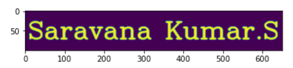
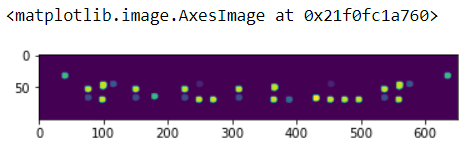

# Opening-and-Closing

## Aim
To implement Opening and Closing using Python and OpenCV.

## Software Required
1. Anaconda - Python 3.7
2. OpenCV
## Algorithm:
### Step1: Import the necessary packages.

### Step2: Create the Text using cv2.putText.

### Step3: Create the structuring element.

### Step4: Execute Opening operation.

### Step5: Execute Closing Operation.

 
## Program:

``` Python
# Import the necessary packages
import numpy as np
import cv2
import matplotlib.pyplot as plt

# Create the Text using cv2.putText
img1=np.zeros((100,650),dtype='uint8')
font=cv2.FONT_HERSHEY_COMPLEX
im=cv2.putText(img1,'Saravana Kumar.S',(7,70),font,2,(255),4,cv2.LINE_AA)
plt.imshow(im)

# Create the structuring element
Kernel=cv2.getStructuringElement(cv2.MORPH_ELLIPSE,(10,10))

# Use Opening operation
image1=cv2.morphologyEx(im,cv2.MORPH_OPEN,Kernel)
plt.imshow(image1)

# Use Closing Operation
image1=cv2.morphologyEx(im,cv2.MORPH_CLOSE,Kernel)
plt.imshow(image1)

```
## Output:

### Display the input Image

<br>

### Display the result of Opening

<br>

### Display the result of Closing

<br>

## Result
Thus the Opening and Closing operation is used in the image using python and OpenCV.